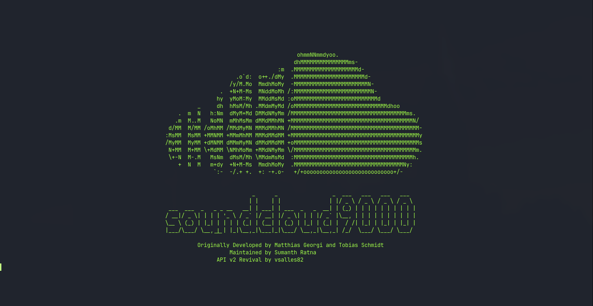
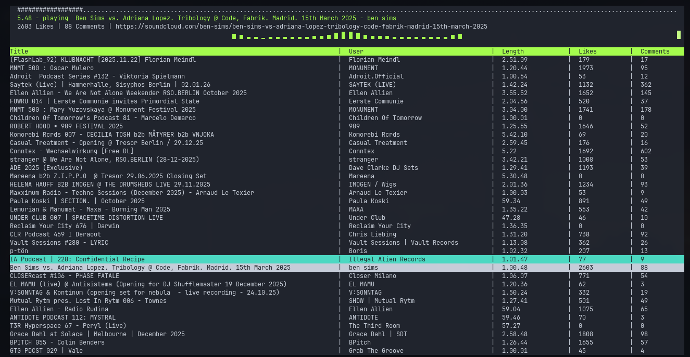

# SoundCloud9000 Modern

A modern revival of the original Ruby/curses SoundCloud terminal player, updated for SoundCloud API v2, modern Ruby versions and current Linux audio systems.


> The next generation SoundCloud terminal client — revived for API v2.

## Screenshots

### Splash screen



### Terminal player



## Features

- SoundCloud API v2 integration
- Liked tracks
- User playlists
- Track search
- Progressive and HLS streams
- Playback through `mpv`
- Automatic next track
- Sequential and shuffle playback
- Playback position controls
- Cava audio spectrum
- Ruby/curses terminal interface
- Arch Linux and Omarchy launcher integration
- Diagnostic command
- No direct ALSA manipulation
- No changes to PipeWire, PulseAudio or Bluetooth configuration
- Only 564 KiB to download
- Only 2.42 MiB installed

## Arch Linux and Omarchy installation

The Arch package is distributed directly through the GitHub Release and is signed with an Ed25519 GPG key.

### Signing-key fingerprint

```text
673D 510C 677C 207A 3461 594B A540 022E 4164 2A0A
```

Download the public key:

```bash
curl -LO \
  https://github.com/vsalles1982/soundcloud9000-modern/releases/download/v0.2.0/soundcloud9000-signing-key.asc
```

Inspect its fingerprint:

```bash
gpg --show-keys --fingerprint \
  soundcloud9000-signing-key.asc
```

Verify that it matches exactly:

```text
673D 510C 677C 207A 3461 594B A540 022E 4164 2A0A
```

Add and locally trust the verified key in the pacman keyring:

```bash
sudo pacman-key --add \
  soundcloud9000-signing-key.asc

sudo pacman-key --lsign-key \
  673D510C677C207A3461594BA540022E41642A0A
```

Install the signed package:

```bash
sudo pacman -U \
  https://github.com/vsalles1982/soundcloud9000-modern/releases/download/v0.2.0/soundcloud9000-0.2.0-2-x86_64.pkg.tar.zst
```

Pacman downloads and verifies the detached signature automatically.

## Configuration

SoundCloud9000 does not include a SoundCloud client ID, OAuth token or browser credential.

Create the local configuration directory:

```bash
mkdir -p ~/.config/soundcloud9000
chmod 700 ~/.config/soundcloud9000
```

Create the configuration file:

```bash
nano ~/.config/soundcloud9000/env
```

Add your own valid SoundCloud API client ID and username:

```bash
SC_CLIENT_ID='YOUR_VALID_CLIENT_ID'
SC_USERNAME='YOUR_SOUNDCLOUD_USERNAME'
```

Protect the file:

```bash
chmod 600 ~/.config/soundcloud9000/env
```

The configuration is owned by the local user and is never included in the Arch package, Git repository or release artifacts.

## Diagnostics

Run:

```bash
soundcloud9000 --doctor
```

Expected result:

```text
OK    Ruby 3.1+
OK    curses gem
OK    mpv executable
OK    cava executable
OK    cava configuration
OK    SC_CLIENT_ID
OK    SoundCloud API
```

## Running

From a terminal:

```bash
soundcloud9000
```

On Omarchy, open the application launcher and search for:

```text
SoundCloud9000
```

## Basic controls

| Key | Action |
|---|---|
| Up / Down | Move through tracks |
| Enter | Play the selected track |
| `n` | Play the next track |
| `m` | Toggle shuffle mode |
| `0`–`9` | Jump through the current track |
| `f` | Switch to liked tracks |
| `s` | Search for tracks |
| `q` | Quit |

Additional controls are shown inside the application when available.

## Package verification

Check the installed package:

```bash
pacman -Q soundcloud9000
pacman -Qo /usr/bin/soundcloud9000
pacman -Qkk soundcloud9000
```

Expected integrity result:

```text
soundcloud9000: 391 total files, 0 altered files
```

Release checksums are available in:

```text
SHA256SUMS
```

Verify downloaded artifacts with:

```bash
sha256sum -c SHA256SUMS --ignore-missing
```

## Package size

| Artifact | Size |
|---|---:|
| Arch package download | 564.4 KiB |
| Installed package | 2.42 MiB |
| RubyGem | approximately 19 KiB |
| Source archive | approximately 20 KiB |

The RubyGem, source archive and Arch package are alternative distribution formats and should not be added together.

## Updating

Download and install the package from a newer GitHub Release:

```bash
sudo pacman -U URL_OF_THE_NEW_SIGNED_PACKAGE
```

Existing configuration under `~/.config/soundcloud9000/` is preserved.

## Uninstalling

Remove the application:

```bash
sudo pacman -Rns soundcloud9000
```

Optionally remove the user configuration:

```bash
rm -r ~/.config/soundcloud9000
```

Removing the configuration is optional and cannot be undone.

## Building the Arch package

Install the build requirements:

```bash
sudo pacman -S --needed \
  base-devel \
  ruby \
  mpv \
  cava \
  ncurses \
  pacman-contrib
```

Clone the repository:

```bash
git clone \
  https://github.com/vsalles1982/soundcloud9000-modern.git

cd soundcloud9000-modern/packaging/arch
```

Build:

```bash
makepkg -Ccf
```

Install the resulting package:

```bash
sudo pacman -U \
  ./soundcloud9000-0.2.0-2-x86_64.pkg.tar.zst
```

All package sources have fixed SHA-256 checksums. No Bundler operation or remote dependency installation occurs during the pacman installation phase.

## Development from source

Install dependencies:

```bash
sudo pacman -S --needed \
  base-devel \
  ruby \
  mpv \
  cava \
  ncurses
```

Install the required Bundler version:

```bash
gem install --user-install bundler:2.7.2
```

Clone and prepare the project:

```bash
git clone \
  https://github.com/vsalles1982/soundcloud9000-modern.git

cd soundcloud9000-modern

bundle _2.7.2_ config set --local path vendor/bundle
bundle _2.7.2_ install
```

Run the test suite:

```bash
bundle _2.7.2_ exec rake
```

Current test status:

```text
9 runs
35 assertions
0 failures
0 errors
0 skips
```

Run from the source tree:

```bash
./soundcloud9000 --doctor
./soundcloud9000
```

## Architecture

- Ruby 3.1+
- curses terminal interface
- SoundCloud API v2
- mpv JSON IPC playback
- Cava spectrum visualization
- PipeWire/PulseAudio-compatible monitoring

The obsolete Audite, PortAudio and direct ALSA audio chain has been removed.

## Security

- No client ID or OAuth token is included.
- User configuration is stored with restricted permissions.
- Arch packages are signed with Ed25519.
- Release artifacts include SHA-256 checksums.
- Runtime installation does not invoke Bundler.
- Package sources have fixed checksums.
- The application does not change system audio configuration.
- Packaging sources are available under `packaging/arch/`.

Report security concerns privately to the repository owner before opening a public issue when appropriate.

## Credits

Originally developed by Matthias Georgi and Tobias Schmidt.

Maintained by Sumanth Ratna.

SoundCloud API v2 revival and Arch Linux packaging by vsalles82.

## License

Released under the MIT License. See [LICENSE](LICENSE).
